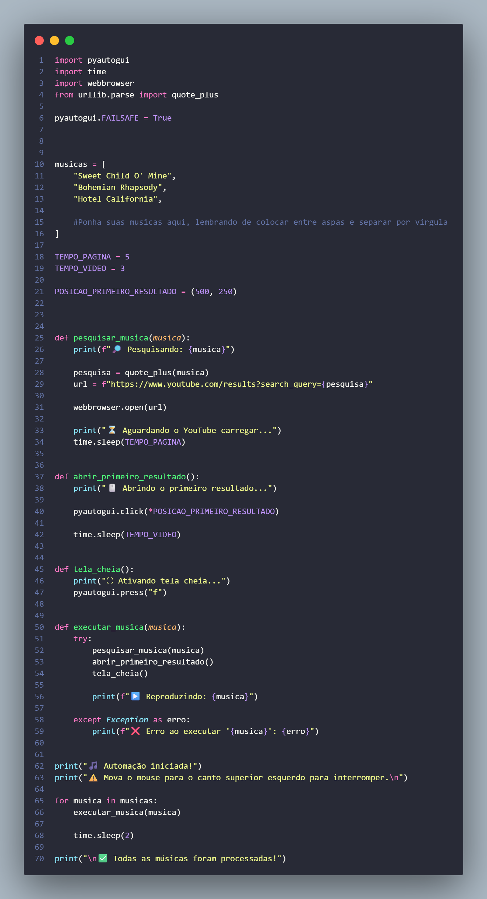

# 🤖 YouTube Automation with PyAutoGUI


Automação simples de tarefas no YouTube utilizando **Python** e **PyAutoGUI**.

## Foto do código



## 🛠️ Tecnologias

- 🐍 Python
- 🖱️ PyAutoGUI
- 🔗 Git
- ▶️ YouTube

## 📦 Instalação

Clone o repositório:

```bash
git clone https://github.com/klss-cyber/rock-automation-in-py.git


